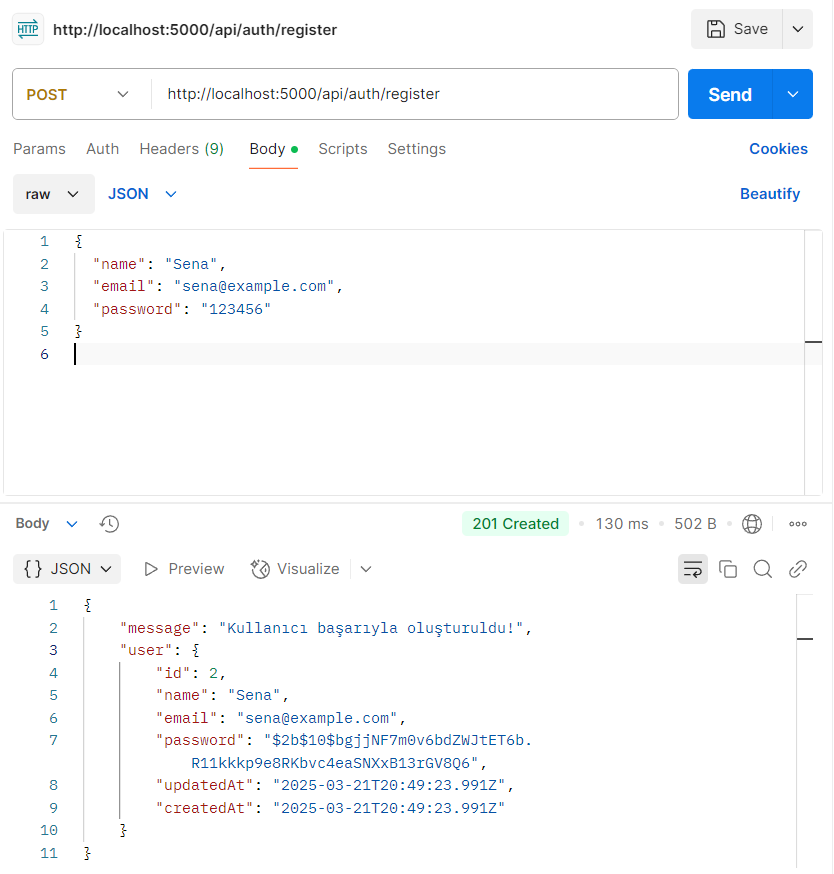
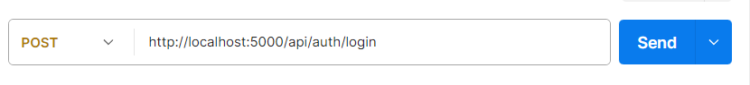
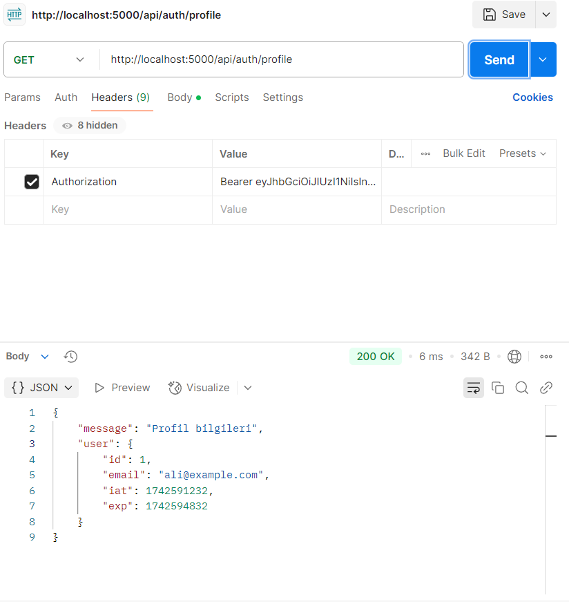
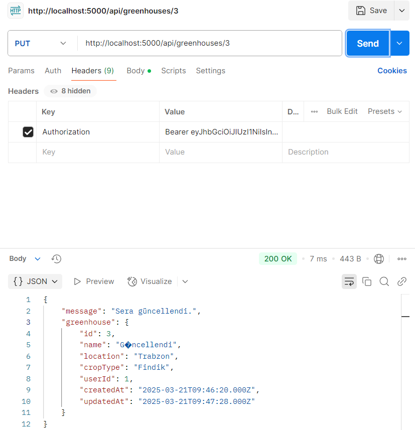
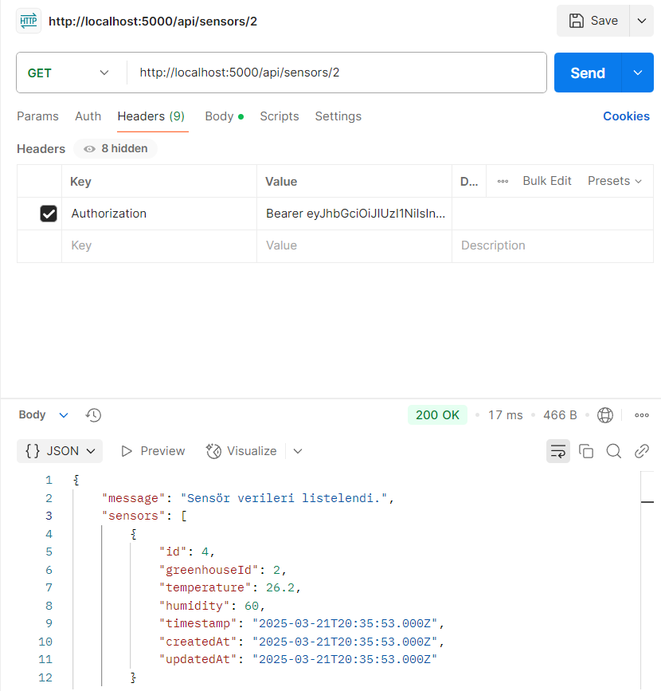

# **Sera Yönetim Sistemi API Projesi**

### Proje Tanımı
Çiftçilerin sera verilerini takip edebilmeleri için temel bir REST API

### Kullanılan Teknolojiler

* Node.js
* Express.js
* Sequelize (ORM)
* MySQL
* JSON Web Tokens (JWT) – authentication için
* bcryptjs – şifreleme için
* Postman – test aracı

### Kurulum Adımları

#### 1. Repoyu Klonla
git clone https://github.com/kullaniciadi/sera-api.git
cd sera-api
#### 2. Paketleri Yükle
npm install
#### 3. .env dosyası oluştur ve database/JWT bilgilerini ekle
- PORT=5000
- DB_HOST=localhost
- DB_USER=root
- DB_PASSWORD=*****
- DB_NAME=*****
- JWT_SECRET=******

#### 4. MYSQL database'ini oluştur
#### 5. Uygulamayı başlatabilirsiniz :))

### API Dokümantasyonu
 
#### 📌 Kullanıcı Yönetimi
* POST /api/auth/register

* POST /api/auth/login

* GET /api/auth/profile

| Kullanıcı Kayıt | 
| Kullanıcı Giriş | 
| Profile | ) |  

#### 📌 Greenhouse (Sera) Yönetimi
* POST /api/greenhouses
Yeni sera ekler. (Token gerekli)

* GET /api/greenhouses
Tüm seraları listeler. (Token gerekli)

* GET /api/greenhouses/:id
Belirli seranın detayını getirir. (Token gerekli)

* PUT /api/greenhouses/:id
Serayı günceller. (Token gerekli)
| Sera güncelleme | ) |  

* DELETE /api/greenhouses/:id
Serayı siler. (Token gerekli)

#### 📌 Sensör Verileri
* POST /api/sensors
Bir seraya ait sensör verisi ekler. (Token gerekli)

Body:

json
Kopyala
Düzenle
{
  "greenhouseId": 1,
  "temperature": 24.5,
  "humidity": 60
}
* GET /api/sensors
Tüm sensör verilerini listeler. (Token gerekli)

* GET /api/sensors/:greenhouseId
Belirli seraya ait verileri getirir. (Token gerekli)
| Sera verisi | ) |

* DELETE /api/sensors/:id
Belirli bir sensör verisini siler. (Token gerekli)

